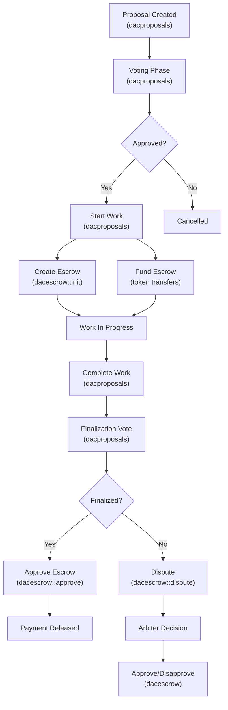

# DAC Escrow and DAC Proposals Contract Documentation

## Table of Contents

1. [Overview](#overview)
2. [DAC Escrow Contract](#dac-escrow-contract)
3. [DAC Proposals Contract](#dac-proposals-contract)
4. [Contract Interactions](#contract-interactions)
5. [Typical Workflows](#typical-workflows)
6. [Security Considerations](#security-considerations)

## Overview

The DAC Escrow and DAC Proposals contracts work together to provide a comprehensive worker proposal and payment system for Decentralized Autonomous Communities (DACs) on the EOSIO blockchain. These contracts enable:

- **Secure fund management**: Escrow services for safe payment handling
- **Democratic governance**: Voting mechanisms for proposal approval
- **Dispute resolution**: Arbiter-based conflict management
- **Transparent workflows**: Clear states and transitions for proposals

## DAC Escrow Contract

### Purpose

The dacescrow contract provides a secure escrow service that holds funds until specific conditions are met. It supports three-party transactions with an arbiter who can resolve disputes between sender and receiver.

### Core Components

#### Data Structures

**escrow_info Table**:

```cpp
struct escrow_info {
    name           key;           // Unique identifier
    name           sender;        // Who sends the funds
    name           receiver;      // Who receives the funds
    name           arb;          // Arbiter for dispute resolution
    extended_asset receiver_pay; // Payment for receiver
    extended_asset arbiter_pay;  // Payment for arbiter
    string         memo;         // Transfer memo
    time_point_sec expires;      // Expiration time
    bool           disputed;     // Dispute status
}
```

### Actions

#### 1. `init(sender, receiver, arb, expires, memo, ext_reference, dac_id)`

**Purpose**: Creates a new escrow agreement

- **Authorization**: Requires sender's authorization
- **Validations**:
  - Receiver and arbiter must be different accounts
  - Sender and arbiter must be different accounts
  - Expiry date must be in the future
- **Effect**: Creates empty escrow entry waiting for funds

#### 2. `transfer(from, to, quantity, memo)` - Notification Handler

**Purpose**: Handles incoming token transfers to fund the escrow

- **Memo Format**: `type:escrow_key:dac_id`
  - `type`: Either "rec" (receiver payment) or "arb" (arbiter payment)
  - `escrow_key`: The unique identifier for the escrow
  - `dac_id`: The DAC identifier
- **Validations**:
  - Escrow must exist
  - Payment slot must be empty (no double payments)
- **Effect**: Updates escrow with payment information

#### 3. `approve(key, approver, dac_id)`

**Purpose**: Approves the escrow, releasing funds

- **Authorization**: Sender or arbiter (if disputed)
- **Rules**:
  - If arbiter approves: escrow must be disputed
  - If sender approves: escrow must NOT be disputed
- **Effect**:
  - Transfers receiver payment to receiver
  - Transfers arbiter payment to arbiter (if any)
  - Deletes escrow record

#### 4. `disapprove(key, disapprover, dac_id)`

**Purpose**: Disapproves the escrow, returning funds to sender

- **Authorization**: Only arbiter
- **Validations**:
  - Escrow must be disputed
  - Escrow must be funded
- **Effect**:
  - Returns receiver payment to sender
  - Pays arbiter fee (if any)
  - Deletes escrow record

#### 5. `refund(key, dac_id)`

**Purpose**: Refunds escrow to sender

- **Authorization**:
  - Receiver (early refund)
  - Sender (after expiration)
  - Contract itself
- **Validations**:
  - Escrow must be funded
  - Must not be disputed
  - If sender calls: must be expired
- **Effect**: Returns funds to sender and deletes escrow

#### 6. `dispute(key, dac_id)`

**Purpose**: Locks escrow for arbiter resolution

- **Authorization**: Receiver or contract itself
- **Validations**: Escrow must be funded
- **Effect**: Sets disputed flag to true, locking the escrow

#### 7. `cancel(key, dac_id)`

**Purpose**: Cancels unfunded escrow

- **Authorization**: Sender
- **Validations**: Escrow must have zero receiver payment
- **Effect**: Deletes escrow record

## DAC Proposals Contract

### Purpose

The dacproposals contract manages the complete lifecycle of worker proposals in a DAC, including creation, voting, execution, and payment through integration with the escrow contract.

### Core Components

#### Data Structures

**proposal Table**:

```cpp
struct proposal {
    name           proposal_id;     // Unique identifier
    name           proposer;        // Who created the proposal
    name           arbiter;         // Dispute resolver
    string         title;           // Proposal title
    string         summary;         // Brief description
    string         content_hash;    // IPFS or other content hash
    extended_asset proposal_pay;    // Payment for work
    extended_asset arbiter_pay;     // Arbiter fee
    bool           arbiter_agreed;  // Arbiter acceptance flag
    name           state;           // Current proposal state
    time_point_sec expiry;          // Voting expiration
    time_point_sec created_at;      // Creation timestamp
    uint32_t       job_duration;    // Work duration in seconds
    uint16_t       category;        // Proposal category
}
```

**proposalvote Table**:

```cpp
struct proposalvote {
    uint64_t       vote_id;
    name           voter;
    optional<name> proposal_id;   // For proposal-specific votes
    optional<uint64_t> category_id; // For category delegation
    optional<name> vote;          // Vote value
    optional<name> delegatee;     // Vote delegation target
}
```

**Proposal States**:

- `pendingappr`: Awaiting custodian approval
- `apprvtes`: Has enough approval votes
- `inprogress`: Work has started
- `pendingfin`: Work complete, awaiting finalization
- `apprfinvtes`: Has enough finalization votes
- `expired`: Proposal has expired
- `indispute`: Under dispute resolution
- `completed`: Successfully completed
- `blocked`: Administratively blocked

### Actions

#### Proposal Creation and Management

##### 1. `createprop(proposer, title, summary, arbiter, proposal_pay, arbiter_pay, content_hash, id, category, job_duration, dac_id)`

**Purpose**: Creates a new work proposal

- **Validations**:
  - Proposer must be whitelisted
  - Arbiter must be whitelisted and active
  - Proposer cannot be the arbiter
  - Title: 3-256 characters
  - Summary: 3-512 characters
  - Positive payment amounts
- **Fee Handling**: Deducts proposal fee from deposited funds
- **Effect**: Creates proposal in pending approval state

##### 2. `voteprop(custodian, proposal_id, vote, dac_id)`

**Purpose**: Custodians vote on proposal approval

- **Vote Options**:
  - `approve`: Support the proposal
  - `deny`: Oppose the proposal
  - `abstain`: Neutral vote
- **Authorization**: Must be current custodian
- **Effect**: Records vote and updates proposal state if threshold met

##### 3. `votepropfin(custodian, proposal_id, vote, dac_id)`

**Purpose**: Custodians vote on work completion

- **Vote Options**: Same as voteprop
- **Requirement**: Proposal must be in finalization state
- **Effect**: Records finalization vote

##### 4. `delegatevote(custodian, proposal_id, delegatee_custodian, dac_id)`

**Purpose**: Delegate voting power for specific proposal

- **Authorization**: Current custodian
- **Effect**: Transfers voting weight to delegatee

##### 5. `delegatecat(custodian, category, delegatee_custodian, dac_id)`

**Purpose**: Delegate voting for entire category

- **Use Case**: Custodians can delegate expertise areas
- **Effect**: Auto-delegates votes for category proposals

#### Workflow Actions

##### 6. `arbagree(arbiter, proposal_id, dac_id)`

**Purpose**: Arbiter agrees to serve on proposal

- **Requirement**: Must be designated arbiter
- **Effect**: Sets arbiter_agreed flag

##### 7. `startwork(proposal_id, dac_id)`

**Purpose**: Begin work on approved proposal

- **Requirements**:
  - Sufficient approval votes
  - Arbiter agreement
  - Valid member status
- **Effects**:
  - Creates escrow via dacescrow contract
  - Transfers funds to escrow
  - Updates state to "in progress"

##### 8. `completework(proposal_id, dac_id)`

**Purpose**: Mark work as complete

- **Authorization**: Proposer
- **Effect**: Changes state to pending finalization

##### 9. `finalize(proposal_id, dac_id)`

**Purpose**: Release payment for completed work

- **Requirements**:
  - Sufficient finalization votes
  - Minimum duration elapsed
- **Effect**: Triggers escrow approval and payment

#### Cancellation and Dispute Actions

##### 10. `cancelprop(proposal_id, dac_id)`

**Purpose**: Cancel proposal before work starts

- **Authorization**: Proposer
- **Requirement**: No active escrow
- **Effect**: Removes proposal

##### 11. `cancelwip(proposal_id, dac_id)`

**Purpose**: Cancel work in progress

- **Authorization**: Proposer
- **Requirement**: Active escrow exists
- **Effect**: Refunds escrow and removes proposal

##### 12. `dispute(proposal_id, dac_id)`

**Purpose**: Initiate dispute on completed work

- **Authorization**: Proposer
- **Effect**: Locks escrow for arbiter resolution

##### 13. `arbapprove/arbdeny(arbiter, proposal_id, dac_id)`

**Purpose**: Arbiter resolution of disputes

- **Authorization**: Designated arbiter
- **Effect**: Approves or denies payment through escrow

#### Administrative Actions

##### 14. `updateconfig(new_config, dac_id)`

**Configuration Parameters**:

- `proposal_threshold`: Votes needed for approval
- `finalize_threshold`: Votes needed for finalization
- `approval_duration`: Time limit for voting
- `proposal_fee`: Fee to create proposals
- `min_proposal_duration`: Minimum work time

##### 15. `addarbwl/updarbwl/rmvarbwl(arbiter, rating, dac_id)`

**Purpose**: Manage arbiter whitelist

- **Rating**: Activity indicator (0 = inactive)

##### 16. `addrecwl/updrecwl/rmvrecwl(receiver, rating, dac_id)`

**Purpose**: Manage receiver/proposer whitelist

## Contract Interactions

### Proposal to Escrow Flow



### Key Integration Points

1. **Escrow Creation**: When `startwork` is called:

   ```cpp
   dacescrow::init_action{escrow, {funding_source, "active"}}
       .to_action(funding_source, proposer, arbiter,
                  expiry, memo, proposal_id, dac_id)
       .send();
   ```

2. **Fund Transfer**: Proposal and arbiter payments:

   ```cpp
   // Receiver payment
   transfer(funding_source, escrow, proposal_pay,
           "rec:proposal_id:dac_id")

   // Arbiter payment
   transfer(funding_source, escrow, arbiter_pay,
           "arb:proposal_id:dac_id")
   ```

3. **Payment Release**: On finalization:
   ```cpp
   action(escrow, "approve",
          make_tuple(proposal_id, funding_source, dac_id))
   ```

## Typical Workflows

### 1. Standard Proposal Workflow

1. **Proposal Creation**

   - Proposer deposits fee (if required)
   - Creates proposal with details and payment amounts
   - Designates an arbiter

2. **Approval Phase**

   - Custodians review and vote
   - Threshold must be met within approval duration
   - Arbiter agrees to participate

3. **Work Execution**

   - Proposer starts work (creates escrow)
   - Funds transfer to escrow contract
   - Work proceeds for specified duration

4. **Completion and Payment**
   - Proposer marks work complete
   - Custodians vote on finalization
   - Successful vote releases payment

### 2. Dispute Resolution Workflow

1. **Dispute Initiation**

   - Work marked complete but contested
   - Receiver initiates dispute
   - Escrow locked for arbitration

2. **Arbiter Review**

   - Arbiter examines evidence
   - Makes decision on payment

3. **Resolution**
   - Approve: Funds to receiver, fee to arbiter
   - Disapprove: Funds returned to sender, fee to arbiter

### 3. Cancellation Scenarios

**Before Work Starts**:

- Proposer calls `cancelprop`
- No escrow exists
- Proposal removed cleanly

**During Work**:

- Proposer calls `cancelwip`
- Triggers escrow refund
- Returns funds to source

**After Expiry**:

- Anyone can call `clearexpprop`
- Cleans up expired proposals
- Handles any remaining escrows

### 4. Vote Delegation Example

```cpp
// Custodian delegates all "development" category votes
delegatecat(custodian, DEVELOPMENT_CATEGORY, expert_custodian, dac_id)

// Later, a development proposal is created
createprop(..., category: DEVELOPMENT_CATEGORY, ...)

// expert_custodian's vote automatically counts for custodian
voteprop(expert_custodian, proposal_id, "approve", dac_id)
```

## Security Considerations

### Access Control

- **Multi-level authorization**: Different actions require specific permissions
- **Role validation**: Custodians, arbiters, and proposers verified
- **Whitelist management**: Controlled access to critical roles

### Fund Safety

- **Escrow isolation**: Funds held in separate contract
- **Time locks**: Expiration prevents indefinite fund locks
- **Dispute mechanism**: Third-party arbitration for conflicts

### State Management

- **Clear state transitions**: Defined workflow prevents invalid states
- **Atomic operations**: Escrow and proposal updates synchronized
- **Vote integrity**: Delegation and direct votes properly tracked

### Best Practices

1. **Arbiter Selection**: Choose reputable, active arbiters
2. **Reasonable Durations**: Set appropriate work and voting periods
3. **Clear Proposals**: Detailed descriptions and deliverables
4. **Regular Maintenance**: Clean expired proposals periodically
5. **Fee Management**: Balance spam prevention with accessibility
